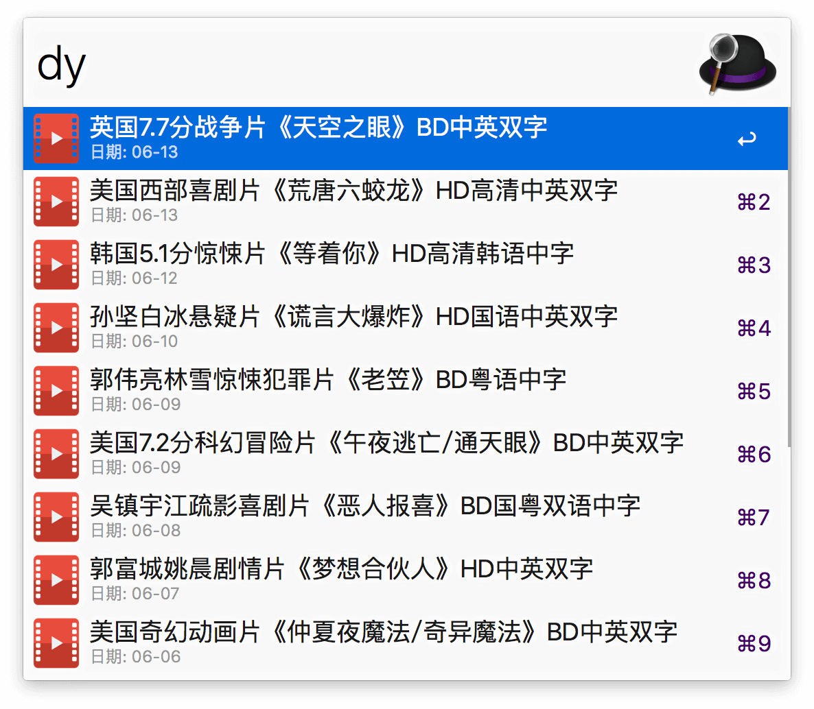

# AlfredWorkflow-DYTT-NewFilms

 一个快速获取电影天堂（www.dy2018.com）上最新资源的Alfred Workflow
 
 ****
 
## 基本说明

这是一个可以通过Alfred 的关键词快速获取[电影天堂](www.dy2018.com) 上最新电影下载资源的Alfred Workflow。使用Python 语言编写，支持最新的Alfred 3。

使用本Workflow 前请确保你的Alfred APP 的Powerpack 功能已经解锁。

## 效果预览

 

## 下载地址
 
[点击下载](https://github.com/Jeff2Ma/AlfredWorkflow-DYTT-NewFilms/blob/master/DYTT-NewFilms.alfredworkflow?raw=true)

## TODO

- 增加Alt 按钮下复制下载链接的功能

## 其它

小问题：由于需要轮番查询豆瓣的API 以获取电影海报封面作为icon，所以速度上略慢，待优化。

Powered by JeffMa at [DeveWork.com](http://devework.com/)， feel free to use :)

